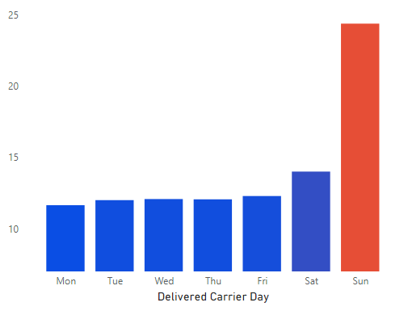
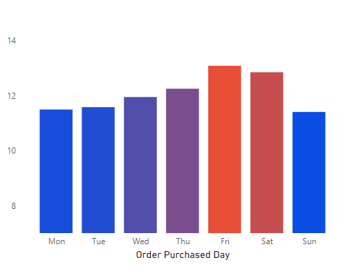
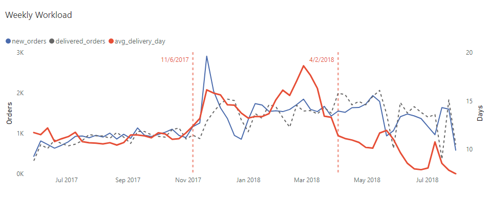
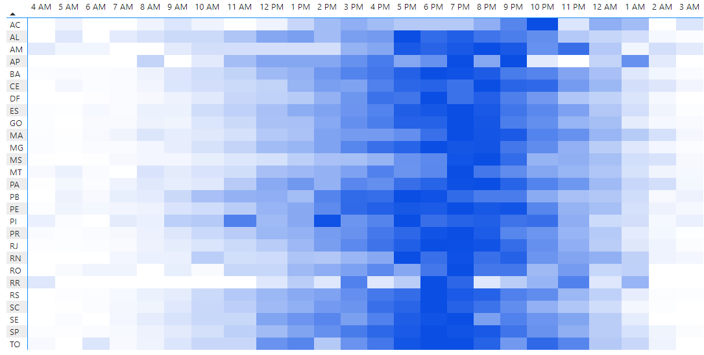
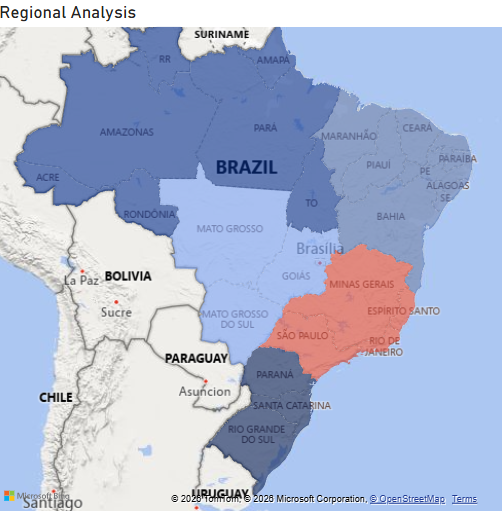
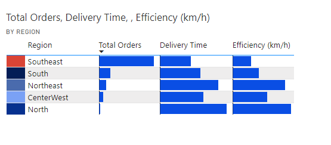
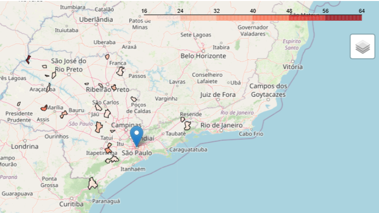
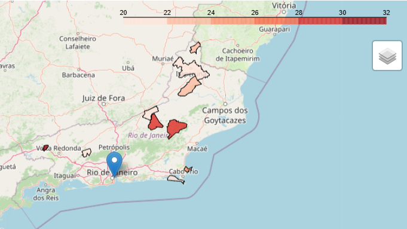

.

  

<h1 align="center"> Delivery Delays Root Cause Analysis </h1>

##  Project Overview
**Olist** is a major Brazilian e‑commerce platform that connects small and medium sellers to customers through a unified marketplace and logistics network. Despite its scale, Olist has faced serious delivery challenges, with some orders experiencing extreme delays—reaching up to 200 days in the most severe cases. These delays harm customer trust and strain operations, making it urgent to understand their root causes. 

This project analyzes the Olist Brazilian E‑Commerce Dataset, containing nearly 100,000 orders from 2016–2018, to uncover why such delays occur and how they can be mitigated.

Key findings are as follow:
* **Weekend operations nearly halt**, with Sundays almost inactive
* **Sunday backlogs cascade into long delays** due to FIFO failures
* **Midday delivery starts** force routes into peak urban traffic
* **Urban areas near hubs** show the **lowest delivery velocity**
* **Routing‑driven logistics sinks** trap low‑volume and remote areas, delaying dispatch

##  Insights
<h3>The Weekend Operational Standstill</h3>
The data shows that logistics activity nearly stops on weekends, creating a structural pause in the fulfillment pipeline. Order intake collapses on Saturday and becomes almost nonexistent on Sunday, which then triggers downstream delays once operations resume.

<h4>Supporting Evidence</h4>
<ul>
    <li><b>Order acceptance on Saturday is ~10% of weekday levels</b>, indicating a sharp reduction in facility intake capacity over the weekend.</li>
    <li>Across a <b>3‑year period</b>, only <b>36 orders were accepted</b> on Sundays across all 27 states, showing Sunday processing is effectively shut down.</li>
    <li>Customer deliveries also drop: <b>Saturday deliveries are ~30% of weekday levels</b>, while <b>Sunday delivery is nearly non-existent</b>.</li>
</ul>

<h4>Customer Impact (Delay Penalty)</h4>

<table>
  <tr>
    <td width="50%" align="center">
      
    </td>
    <td width="50%" valign="middle">
      The standstill does not just “pause” orders—it amplifies delays. 
      Orders that reach carriers on Sunday experience a <b>double mean delivery time of 12 days.</b>
    </td>
  </tr>
</table>

<h4>Evidence of a First‑In, Last‑Out Backlog Effect</h4>

<table>
  <tr>
    <td width="50%" valign="middle">
This effect is further reinforced by the observed wait‑time distribution by order day.  
Orders placed on <b>Friday and Saturday consistently experience the longest waiting periods</b>, indicating that they enter the system just before the weekend pause.  
When operations resume, these early orders are systematically overtaken by higher‑volume weekday intake, providing clear empirical evidence of a <b>First‑In, Last‑Out (FILO)</b> backlog dynamic.
    </td>
    <td width="50%" align="center">
      
    </td>
  </tr>
</table>

<h3>Capacity Breakdown Under Demand Surge</h3>

  

To isolate structural effects, the analysis focuses on the period from June 2017 to July 2018. From July through November, delivery performance remains stable, with average delivery time holding at approximately 10 days. In November, a sudden surge in demand—nearly triple the normal order volume—pushed the delivery system beyond its operating capacity. Despite the team doubling throughput to nearly 2,000 parcels per week, average delivery time still rose to over 15 days.

As incoming demand later stabilized at around 1,500 orders per week, the system failed to fully recover. The accumulated backlog continued to grow, driving delivery time to a peak of 19 days by the end of February. Only by early April was the delivery debt finally cleared, returning average delivery time to its baseline. In total, the system remained under stress for more than four months.

<b>Note:</b> These dynamics indicate a <b>clear capacity threshold: </b> when weekly volume exceeds <b>approximately 2,000 orders </b>, backlog accumulation accelerates and recovery becomes slow and prolonged.

 
<h3>Late-Shift Delivery Window</h3>

  

Delivery activity follows a rigid, late‑leaning operational window from <b>noon to midnight</b>.

This structure implies that local hubs spend the most productive morning hours on internal sorting rather than outbound transit, delaying route initiation. As routes begin near midday, vehicles are pushed directly into <b>peak urban congestion </b>, reducing delivery velocity. Extending operations toward midnight further signals difficulty clearing daily volume within standard hours, highlighting systemic inefficiencies in last‑mile scheduling.

<h3>The Velocity Paradox: Long-Haul vs. Urban Friction</h3>

<table style="width: 100%; border-collapse: collapse;">
  <tr>
    <td width="500" valign="top">
      
    </td>
    <td rowspan="2" valign="top" style="padding-left: 20px;">
      
      

        The <b>South‑East</b> region functions as the operational powerhouse, accounting for nearly <b>70% of total order volume</b>. While it achieves the shortest delivery times, it paradoxically records the lowest efficiency in terms of delivery speed (km/hr), reflecting heavy urban friction and congestion.
      

      

        In contrast, the North—despite being the farthest region and contributing less than 2% of total orders—achieves the highest efficiency score, highlighting how low volume and uncongested routes enable faster transit over longer distances.
      

    </td>
  </tr>
  <tr>
    <td width="500"></td>
  </tr>
</table>

<h3>Routing-Driven "Logistics Sinks"</h3>

<table style="width: 100%; border-collapse: collapse;">
  <tr>
    <td width="500" valign="top">
      
    </td>
    <td width="500" valign="top">
      
    </td>
  </tr>
  <tr>
    <td colspan=2>
      

        Low‑volume municipalities in São Paulo (SP), particularly those distant from the São Paulo metropolitan center, experience the most severe delivery delays. Sparse demand in these regions prevents frequent dispatches, causing orders to accumulate at hubs until batch‑routing thresholds are met. As a result, delivery timing is dictated by routing efficiency rather than order placement, leading to prolonged wait times.
      

    </td>
  </tr>
</table>

## Strategic Recommendations

1. **Shift Dispatch to "Early-Bird" Hours**: Move the local hub sorting process to night shifts to allow drivers to depart by 8:00 AM. This would bypass peak afternoon traffic and ensure deliveries are completed by a customer-friendly 8:00 PM cutoff.

2. **Enforce FIFO Priority**: Implement a strict First-In, First-Out rule for Monday mornings to ensure weekend backlogs are processed before new Monday arrivals.

3. **Scheduled vs. Volume-Based Routing**: For "orphan" municipalities in SP and RJ, transition from volume-based dispatch (waiting for a full truck) to a fixed-schedule rotation to eliminate long-tail wait times.

## Data Source

The analysis is based on the Olist Brazilian E-Commerce Dataset, which contains information on approximately 100,000 orders from 2016 to 2018.

**Dataset Origin:** [Kaggle - Brazilian E-Commerce Public Dataset by Olist](https://www.kaggle.com/datasets/olistbr/brazilian-ecommerce)
**Data Volume:** 100k+ orders across 73 product categories.

## Tech Stack

**Tools:** Python, Power BI, Statistics

**Data Manipulation:** pandas, numpy

**Spatial Analysis:** geopandas, h3

**Statistical Testing:** scipy.stats (Chi-Squared, Correlation analysis)

**Visualization:** matplotlib, seaborn, folium

## Analysis Files

**[EDA & Data Hygiene](notebooks/data_hygiene.ipynb)**: Auditing for batch updates and identifying reporting lag patterns.

**[Temporal Analysis](notebooks/temporal_analysis.ipynb)**: Investigating the Sunday 12-day penalty, weekday delivery windows, and weekly delivery capacity.

**[Spatial Velocity & Mapping](notebooks/regional_performance.ipynb)**: Calculating the "Velocity Paradox" across regions.

**[Product & Attribute Testing](notebooks/attribute_testing.ipynb):** Testing the impact of product attributes(weight, lenght, width, height), and distance(seller to customer) on delivery time.

**[Analysis of Most Impactful Regions, SP & RJ](notebooks/sp_rj.ipynb):** Analyze the characteristics of the municipalities that experience the most severe delays in the São Paulo and Rio de Janeiro regions.

## Future Work

1. **Predictive Modeling (Regression Analysis)**
Build a Multiple Linear Regression model to quantify the exact weight of the "Sunday Penalty" on delivery timelines.

## Author

Saw Yu Nwe

Project Status: Phase 1 (Diagnostic) Complete | Phase 2 (Predictive & Automation) In Progress.
